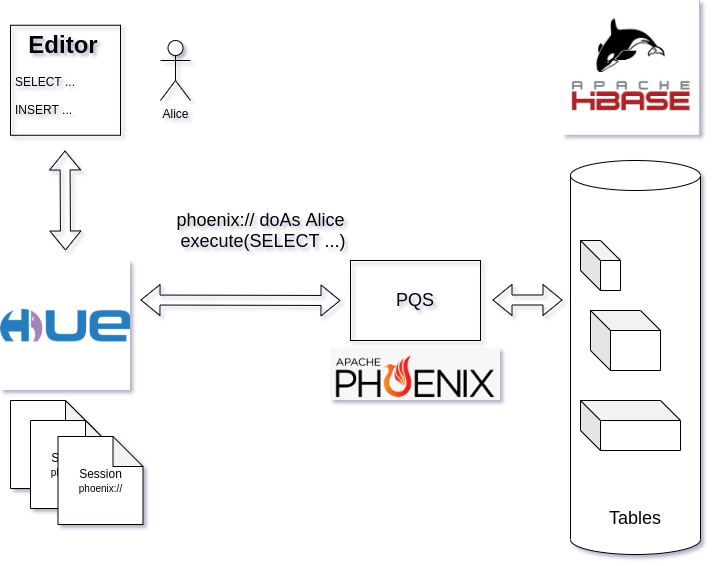

---
hide:
  - toc
---
# Cloudera Hbase Hands on Lab

The goal of this workshop is to have fun!!!

!!! info "What to expect"
    You will learn how to optimize a Phoneix Table in order to get the best performance for your applications
    good time!

## The Stack

* **Hbase**: Real time wide column Database
* **Phoenix**: SQL languange Over Hbase

!!! tip
    Use the workshop instructions to follow the flow, but also use the time to explore the product and learn new things and tricks. We expect you to be more confident with the product and lead workshops with customers with what you learn here today.

* :simple-cloudera:{ .lg .middle } &nbsp; **Lab 0. Access Cloudera Environment**

    ***

    **Goals**
        - [ ] Use Case Overview
        - [ ] Connect to Cloudera on cloud control plane

    ***

    [:octicons-arrow-right-24: Go to Lab 0 Guide](../lab0/README.md)

* :simple-cloudera:{ .lg .middle } &nbsp; **Lab 1. Loading data to HBase**

    ***

    **Goals**
        - [ ] Create the Phoenix connection
        - [ ] Creating your **first** table
        - [ ] Loading dummy data into the table

    ***

    [:octicons-arrow-right-24: Go to Lab 1 Guide](lab1/README.md)

* :simple-cloudera:{ .lg .middle } &nbsp; **Lab 2. Query the tables data**

    ***

    **Goals**
        - [ ] Login to HUE
        - [ ] Query the Tables data and understand what happens behind the scenes

    ***

    [:octicons-arrow-right-24: Go to Lab 2 Guide](lab2/README.md)

* :simple-cloudera:{ .lg .middle } &nbsp; **Lab 3. Optimizong HBase tables**

    ***

    **Goals**
        - [ ] Create the new HBase table that will get better performance
        - [ ] Loading the data from the old table
        - [ ] Creating index over the data
        - [ ] Understanding range scans

    ***

    [:octicons-arrow-right-24: Go to Lab 3 Guide](lab3/README.md)

* :simple-cloudera:{ .lg .middle } &nbsp; **Lab 4. Query the optimized tables data**

    ***

    **Goals**
        - [ ] Query the Tables data and understand what happens behind the scenes

    ***

    [:octicons-arrow-right-24: Go to Lab 4 Guide](lab4/README.md)

