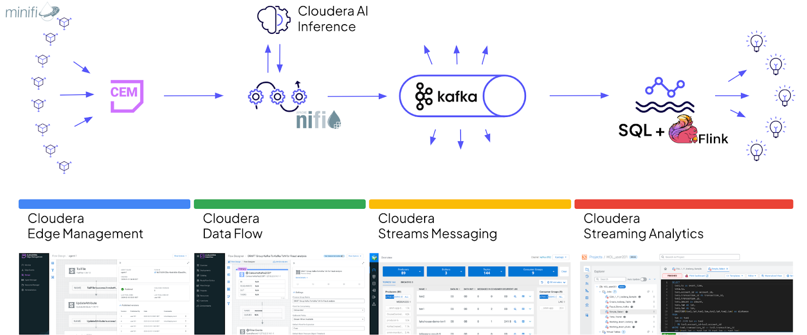

---
hide:
  - toc
---
# Cloudera NiFi Edge2AI Hands on Lab

The goal of this workshop is to give you some hands-on experience with the Cloudera's Data in Motion stack. You will be able to walk through an end-to-end (or "edge to AI") use case using Cloudera Edge Management, Cloudera Data Flow, Cloudera Streams Processing, Cloudera Streaming Analytics and Cloudera AI Inference products.

!!! info "What to expect"
    This scavenger hunt Hands on Lab challenges you to understand a real-time fraud detection system built on Cloudera's leading data stack.

    You'll investigate suspicious transactions by tracing the data flow from edge to real-time SQL analytics. This builds upon the successful Edge2Ai Fraud transaction analytics, updated to promote certain features.

## The Stack

* **MiNiFi**: Generates synthetic transaction events and routes them to Kafka.
* **Edge Flow Manager (EFM)**: Manages the entire fleet of deployed MiNiFi agents.
* **DataFlow/NiFi**: Copy transaction events from edgeTopic to fraudulent Topic for further analysis
* **Schema Registry**: Stores and manages the schema for transaction events.
* **Kafka**: Receives and distributes transaction events to consumers.

!!! tip
    Use the workshop instructions to follow the flow, but also use the time to explore the product and learn new things and tricks. We expect you to be more confident with the product and lead workshops with customers with what you learn here today.

- :simple-cloudera:{ .lg .middle } &nbsp; **Lab 0. Access Cloudera Environment**

    ***

    **Goals**

    - [ ] Use Case Overview
    - [ ] Connect to Cloudera on cloud control plane

    ***

    [:octicons-arrow-right-24: Go to Lab 0 Guide](../lab0/README.md)

- :simple-cloudera:{ .lg .middle } &nbsp; **Lab 1. Getting Data from the Edge**

    ***

    **Goals**

    - [ ] Explore Edge Flow Manager interface
    - [ ] Monitor and manage edge MiNiFi agents

    ***

    [:octicons-arrow-right-24: Go to Lab 1 Guide](lab1/README.md)

- :simple-cloudera:{ .lg .middle } &nbsp; **Lab 2. Managing Schemas with Schema Registry**

    ***

    **Goals**

    - [ ] Understand the role of Schema Registry in data pipeline architecture
    - [ ] Locate, examine and Verify the FinTransactions schema in Schema Registry

    ***

    [:octicons-arrow-right-24: Go to Lab 2 Guide](lab2/README.md)

- :simple-cloudera:{ .lg .middle } &nbsp; **Lab 3. Receive Edge Data in Data Flow**

    ***

    **Goals**

    - [ ] Verify data flowing from edge MiNiFi agents to the Cloudera Data Flow deployment
    - [ ] Examing utlization and statistics of the deployed flow
    - [ ] Become familar with the components that make up the Data Flow

    ***

    [:octicons-arrow-right-24: Go to Lab 3 Guide](lab3/README.md)

- :simple-cloudera:{ .lg .middle } &nbsp; **Lab 4. Moving Data with NiFi DataFlow**

    ***

    **Goals**

    - [ ] Configure and deploy a flow from the Flow Catalog
    - [ ] Monitor flow performance using KPIs to ensure data isn't backing up in the pipeline
    - [ ] Verify end-to-end data flow from edge data topic to fraud analysis topic in Streams Messaging Manager

    ***

    [:octicons-arrow-right-24: Go to Lab 4 Guide](lab4/README.md)

- :simple-cloudera:{ .lg .middle } &nbsp; **Lab 5. Using Kafka to Move Data Across Applications**

    ***

    **Goals**

    - [ ] Monitor specific Kafka topics using Streams Messaging Manager
    - [ ] Verify data is flowing from the NiFi deployment to downstream Kafka topics

    ***

    [:octicons-arrow-right-24: Go to Lab 5 Guide](lab5/README.md)

- :simple-cloudera:{ .lg .middle } &nbsp; **Lab 6. AI with NiFi DataFlow**

    ***

    **Goals**

    - [ ] Deploy NiFi DataFlow to integrate with Cloudera AI Inference service
    - [ ] Process transaction data through an AI model
    - [ ] Configure Kafka topics for AI-enhanced data pipeline

    ***

    [:octicons-arrow-right-24: Go to Lab 6 Guide](lab6/README.md)

