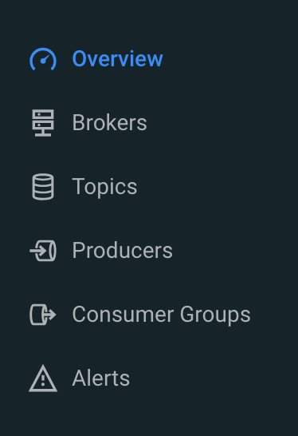

# Using Kafka to Move Data Across Applications

**Goals**

- [ ] Monitor specific Kafka topics using Streams Messaging Manager
- [ ] Verify data is flowing from the NiFi deployment to downstream Kafka topics

## Overview

In our line of business we need that data be available for our analytical applications without delays. Kafka is an excellent messaging service that allows our applications to exchange a large amount of data extremely fast, with very low latency.

We need to ensure that Kafka is running ok at all times and a monitoring tool like Streams Messaging Manager is extremely helpful to us.

Before delving into the transaction analytics, take a few moments to ensure Kafka is running smoothly.

## Tasks

* Navigate to **Streams Messaging Manager,** which is located in **{{ smm_datahub_name | default("cdf-aw-kafka-demo") }}** Data Hub.

* In Streams Messaging Manager, explore the menus on the left-hand menu bar. If the meaning of the icons are not intuitive, you can expand the bar by clicking the chevron (`>>`) at the bottom.

* Click the **Topics** drop down at the top of the Overview screen to search for topic names

* Click the magnifying glass at any topic item to open the Data Explorer and browse topic messages for that topic

* If you can't find the Data Hub Clusters icon, click on the "tic-tac-toe" menu at the top-left corner

### Checklist

- [ ] How much data has the topic **`edge-data-<Scavenger_Hunt_UserID>`** received in the **past hour**? And in the **last 24 hours**?
- [ ] What is the number of flow files queued for your running deployment?
- [ ] What is the actual value for the **Data Input Format** and **Data Output Format** parameters for the running deployment?
- [ ] What's the topic name that the new flow deployment is writing to?
- [ ] Can you see new data coming into this topic in Streams Messaging Manager?

**:rocket: We have now concluded Lab 6 :rocket:**
